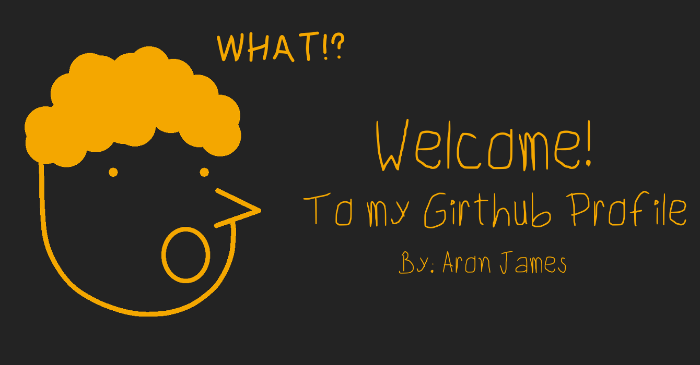

# 
Hola, I'am Aron James 😄

## About Aron James 👨‍💻
Aron James is a graduate of vocational course **Computer Hardware Servicing**, Focus on Hardware and Software, Troubleshoot, and Network Configuration. After he take a vocational course he continue his journey to be an **_I.T Professional_** he take a 4 year's course and now he is graduating **BS Information Technology Student**. Aron James like and actively attending Seminar, Workshop, and Training to improve his personality and skill's. In his 3rd year of BSIT Aron is elected as President of Society of Information Technology Students and Public Information Officer of Central Student Government.

In his last year as a BS Information Technology, AJ focus on **Web Development** and engage herself to build his skill's in web development also in his internship and capstone project to achieve his goal. **_AJ have a good experience in HTML, CSS and good understanding in JavaScript, Jquery, Bootstrap Framework, and SASS. In his Back-End have a good understanding in PHP and MySQL basic create, read, update, delete. Knowledge in Version Control using Git (GIthub, Gitlab, and GitKraken). And now AJ exploring his knowledge in Cloud Computing Amazon Web Service, Azure._** 

- 🔭 I’m currently working on my Portfolio.
- 🌱 I’m currently learning Javascript & C#.
- 👯 I’m looking to collaborate on Youtube.
- 🤔 I’m looking for help with C#.
- 💬 Ask me about anything new technology.
- 🤗 Goal for 2020: First Job, Youtube Channel.
- 📫 How to reach me: <ajms.072799@gmail.com>.
- ⚡ Fun fact: Exploring or learning new things 🔥

### Language and Tools: 

